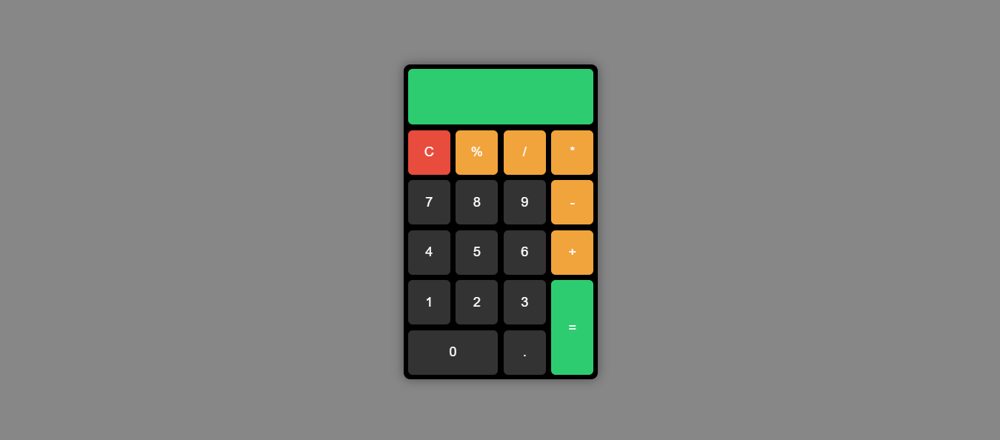

# 🧮 Calculadora

Uma calculadora simples desenvolvida com **HTML**, **CSS** e **JavaScript**, como parte dos meus estudos de Front-End. O projeto tem como objetivo praticar lógica de programação, manipulação do DOM e estilização com CSS puro.

---

## 📸 Demonstração



[🔗 Acesse a calculadora online](https://wanderlywrs.github.io/calculadora)

---

## ⚙️ Funcionalidades

- [x] Operações básicas: adição, subtração, multiplicação e divisão
- [x] Limpar toda a conta
- [x] Botão backspace (apagar último número)
- [x] Teclado funcional (opcional)
- [x] Responsiva (funciona bem em celular)

---

## 🛠️ Tecnologias utilizadas

- HTML5
- CSS3
- JavaScript Vanilla (puro)

---

## 📁 Como clonar e rodar o projeto

```bash
# Clone o repositório
git clone https://github.com/wanderlywrs/calculadora.git

# Acesse a pasta
cd calculadora

# Abra o arquivo index.html em seu navegador
